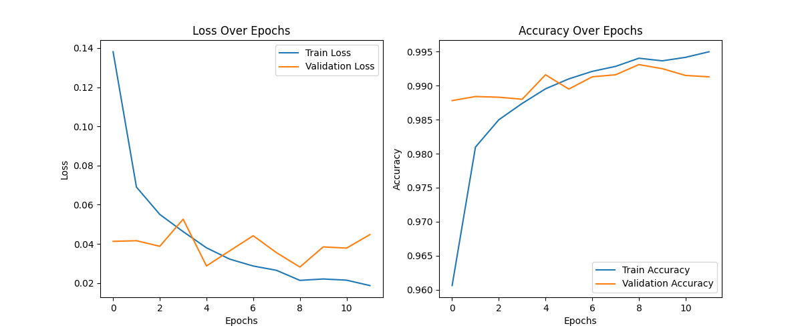

# Handwritten Digit Recognition

A deep learning-powered handwritten digit recognition system that allows users to draw digits on a canvas and a trained CNN model will try to recognize it.

## Features
✅ Users can draw digits on an interactive canvas  
✅ Preprocessing done with OpenCV  
✅ Prediction using a trained Convolutional Neural Network (CNN)  
✅ Model built with TensorFlow  

## Installation

### 1️⃣ Clone the Repository
```bash
git clone https://github.com/LNikolov01/handwritten_digit_recognition.git
cd Handwritten_Digit_Recognition
```

### 2️⃣ Install Dependencies
```bash
pip install -r requirements.txt
```

## Usage

### Run the Application
```bash
python3 app.py
```
- Draw a digit (0-9) in the window that appears.
- Press 's' to classify the digit. (Or 'q' to quit)
- The program will print the recognized digit and confidence score.

## Project Structure
```
Handwritten_Digit_Recognition/
│── app.py               # Main application script
│── train_model.py       # Model training script
│── draw_digit.py        # Allows users to draw digits
│── process_image.py     # Image preprocessing for the model
│── requirements.txt     # Dependencies
│── cnn_model.h5         # Trained CNN model
│── README.md            # Project documentation
```

## Example Output
```
Predicted Digit: 3
Confidence: 98.75%
```

## Model Details
- **Architecture:** Convolutional Neural Network (CNN)
- **Dataset:** Trained on the MNIST dataset (28x28 grayscale images)

## 📊 Model Performance

### ✅ Test Accuracy & Loss
- **Test Accuracy:** 99.17%  
- **Test Loss:** 0.0422  

### 📜 Classification Report:
```
              precision    recall  f1-score   support

           0       1.00      0.99      0.99       980
           1       1.00      1.00      1.00      1135
           2       1.00      0.98      0.99      1032
           3       1.00      0.99      0.99      1010
           4       0.99      1.00      0.99       982
           5       0.99      0.99      0.99       892
           6       0.99      0.99      0.99       958
           7       0.97      1.00      0.98      1028
           8       1.00      0.99      0.99       974
           9       0.99      0.99      0.99      1009

    accuracy                           0.99     10000
   macro avg       0.99      0.99      0.99     10000
weighted avg       0.99      0.99      0.99     10000
```

### 📈 Training Performance Graphs
Below are the training accuracy and loss plots of the model:



## 📜 Model Configuration
```yaml
model:
  type: "CNN"
  layers:
    - Conv2D: {filters: 32, kernel_size: [3,3], activation: "relu", input_shape: [28, 28, 1]}
    - MaxPooling2D: {pool_size: [2,2]}
    - BatchNormalization: {}
    - Conv2D: {filters: 64, kernel_size: [3,3], activation: "relu"}
    - MaxPooling2D: {pool_size: [2,2]}
    - BatchNormalization: {}
    - Conv2D: {filters: 128, kernel_size: [3,3], activation: "relu"}
    - BatchNormalization: {}
    - Flatten: {}
    - Dense: {units: 256, activation: "relu"}
    - Dropout: {rate: 0.5}
    - Dense: {units: 10, activation: "softmax"}
training:
  epochs: 12
  batch_size: 32
  optimizer: "adam"
dataset:
  name: "MNIST"
  input_shape: [28, 28, 1]
  classes: 10
```

## Planned Future Improvements
- ✅ Data augmentation to improve generalization
- ✅ Model training script for custom datasets
- ✅ Web-based interface with Flask
- ✅ Deployment as a web app